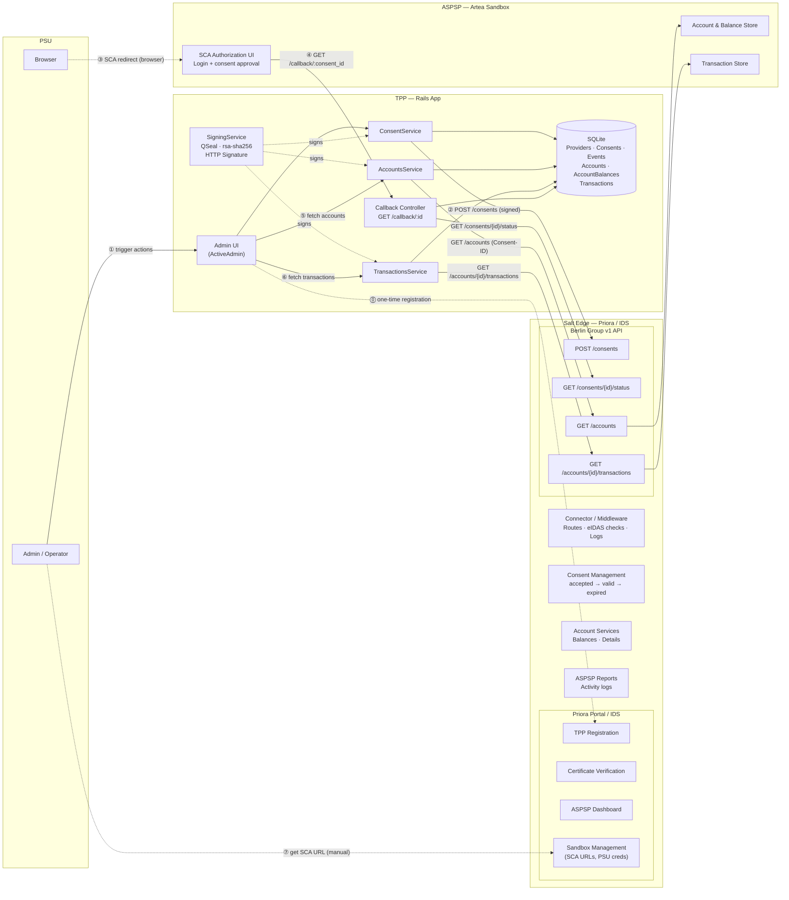

# Functional Diagram

## Goal

Capture a high-level Open Banking AIS functional view for this demo, covering all actors and
functional blocks required by Milestone 5.

## Actors

| Actor | Role |
|---|---|
| **PSU** (Payment Service User) | End-user operating the browser and the Admin UI to initiate consent, trigger account/transaction fetches, and complete SCA. |
| **TPP** (Third-Party Provider) | This Rails app: manages consent lifecycle, signs and sends Berlin Group API requests, handles callbacks, persists data. |
| **Salt Edge / IDS** (Identity & Directory Service) | Priora portal and connector middleware. Handles TPP registration, certificate verification, API routing, consent lifecycle tracking, ASPSP dashboard, and sandbox management. |
| **ASPSP** (Account Servicing Payment Service Provider) | Artea sandbox. Exposes SCA authorization UI, account data, balance data, and transaction data via the Salt Edge connector. |

## Functional Blocks

| Block | Actor | Description |
|---|---|---|
| **Consent Management** | TPP + Salt Edge | Create, status-check, and update consent records (accepted → valid → expired). |
| **Account Services** | TPP + Salt Edge + ASPSP | Fetch account list with optional balance data per `resourceId`; upsert into SQLite. |
| **TPP Certificate Verification** | Salt Edge | Validate QSEAL certificate (eIDAS, PSD2 `QCStatement`, `PSP_AI` role) on every signed request. |
| **ASPSP Reports** | Salt Edge | Activity logs and API access reports visible via Priora portal for the ASPSP operator. |
| **ASPSP Dashboard** | Salt Edge | Portal view for ASPSP to inspect consents, authorisations, and connected TPPs. |
| **Sandbox Management** | Salt Edge | Artea sandbox configuration, test PSU credentials, and SCA redirect URL lookup. |

## Happy-Path Flow (numbered)

```
⓪  One-time: TPP registers with Salt Edge (QSEAL cert, async validation)
①  Admin / PSU triggers "Create Consent" in Admin UI
②  TPP signs and POSTs /consents to Salt Edge Berlin Group v1 API
③  Admin retrieves SCA redirect URL from Priora portal (manual; no scaRedirect in API response)
    Browser navigates to SCA URL (via Salt Edge connector → Artea SCA UI)
④  PSU logs in and approves consent; Artea redirects browser to GET /callback/:consent_id
    TPP checks consent status (GET /consents/{id}/status) and marks consent valid
⑤  Admin triggers "Fetch Accounts"; TPP GETs /accounts (signed, Consent-ID header)
    Accounts and balances upserted in SQLite
⑥  Admin triggers "Fetch Transactions"; TPP GETs /accounts/{id}/transactions
    Transactions upserted (booked) or recreated (pending) in SQLite
⑦  (Manual) Admin reads SCA URL from Priora portal when scaRedirect is absent in API response
```

## Mermaid Diagram (high-level)



## Diagram Artifacts

- Source: `docs/diagrams/open_banking_system.drawio`
  Open with [draw.io](https://app.diagrams.net/) or the draw.io VS Code / JetBrains plugin.
- Mermaid inline diagram above renders in GitHub and most Markdown viewers.

## Design Notes

- The SCA redirect URL is obtained manually from the Priora portal (step ⑦) because the
  `POST /consents` response from the Artea sandbox does not include `_links.scaRedirect`
  (inconsistency #7 in `inconsistencies_and_errors.md`).
- All outbound TPP requests are signed by `SigningService` using the provider's QSEAL certificate
  (rsa-sha256, HTTP Signature draft-cavage-12). The `keyId` format observed in production is
  `SN={serial},DN={issuer}` — not a hex fingerprint as the discovery notes initially assumed.
- The Callback Controller handles path-based consent correlation (`/callback/:consent_id`) because
  the Artea sandbox returns no `state` or `code` query parameters.
- `IDS` as used in Salt Edge documentation refers to the Identity & Directory Service role played
  by the Priora portal — it is Salt Edge's internal term for the actor that manages TPP identity,
  certificate validation, and directory services.
